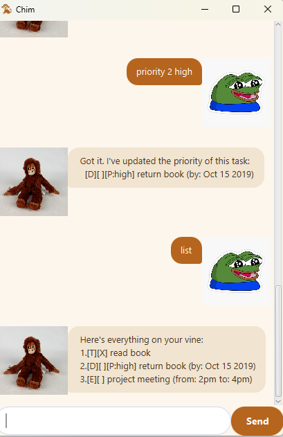

# Chim User Guide

Chim is a friendly, chimpanzee-themed desktop chatbot that helps you keep track of your **todos**, **deadlines**, 
and **events** — all through simple typed commands. If you can type fast, Chim can manage your tasks faster than 
any point-and-click app.

## Quick start

1. Ensure you have **Java 17 or above** installed on your computer.
2. Download the latest `chim.jar` from the [releases page](https://github.com/sealfromdowntown/ip/releases).
3. Copy the file to the folder you want to use as the home folder for Chim.
4. Open a command terminal, `cd` into the folder containing the jar file, and run:
5.    A GUI similar to the one below should appear in a few seconds.
5. Type a command in the text box and press Enter or click **Send** to try it out. Some examples:
    - `list` — shows all your tasks
    - `todo read book` — adds a todo
    - `deadline return book /by 2019-10-15` — adds a deadline
    - `bye` — exits Chim
6. Refer to the [Features](#features) below for details of each command.

## Features

> 💡 **Notes on the command format**
> - Words in `UPPER_CASE` are parameters to be supplied by you, e.g. in `todo DESCRIPTION`, 
> `DESCRIPTION` is a parameter.
> - Extra whitespace between words in a command may cause it to be misread — keep commands to single spaces.

### Adding a todo: `todo`

Adds a simple task with no date attached.

Format: `todo DESCRIPTION`

Example: todo read book

### Adding a deadline: `deadline`

Adds a task that needs to be done by a specific date.

Format: `deadline DESCRIPTION /by DATE`

- `DATE` must be in `yyyy-mm-dd` format, e.g. `2019-10-15`.

Example: deadline return book /by 2019-10-15

### Adding an event: `event`

Adds a task that occurs over a specific time range.

Format: `event DESCRIPTION /from START /to END`

Example: event project meeting /from 2pm /to 4pm

### Listing all tasks: `list`

Shows every task currently on your list, numbered from 1.

Format: `list`

### Marking a task as done: `mark`

Marks the specified task as completed.

Format: `mark INDEX`

- `INDEX` refers to the number shown in the `list` output. Must be a positive integer.

Example: mark 2

### Marking a task as not done: `unmark`

Marks the specified task as not yet completed.

Format: `unmark INDEX`

Example: unmark 2

### Setting a task's priority: `priority`

Sets a priority level on the specified task, shown as a tag next to it.

Format: `priority INDEX LEVEL`

- `LEVEL` must be one of: `high`, `medium`, `low`, `none`.

Example: priority 1 high

### Deleting a task: `delete`

Removes the specified task from the list.

Format: `delete INDEX`

Example: delete 3

### Finding tasks: `find`

Finds all tasks whose description contains the given keyword. The search is case-insensitive.

Format: `find KEYWORD`

Example: find book

### Exiting the program: `bye`

Exits Chim.

Format: `bye`

## Saving the data

Chim automatically saves your task list to disk after every command that changes it. There's no need to save manually. 
Data is stored in a `data` folder alongside the jar file, and reloaded automatically the next time you start Chim.

## Error handling

Chim tries to catch common mistakes and explain what went wrong instead of crashing, including:

- Unrecognised commands
- Missing or empty descriptions
- Missing `/by`, `/from`, or `/to` markers
- Duplicate markers (e.g. two `/by`s in one command)
- Invalid or non-existent dates
- Task numbers that don't exist
- Duplicate tasks with identical details
- An event whose start date is after its end date

## Acknowledgements

- This project was built starting from the [SE-EDU Duke project template](https://github.com/nus-cs2103-AY2627-S1/ip), 
and the JavaFX GUI was built following the 
[SE-EDU JavaFX Tutorial](https://se-education.org/guides/tutorials/javaFx.html), 
including its FXML, DialogBox, and CSS styling patterns.
- The Checkstyle configuration follows the 
[SE-EDU Java coding standard](https://se-education.org/guides/conventions/java/intermediate.html), 
using the config files from 
[AddressBook-Level3](https://github.com/se-edu/addressbook-level3/tree/master/config/checkstyle).
